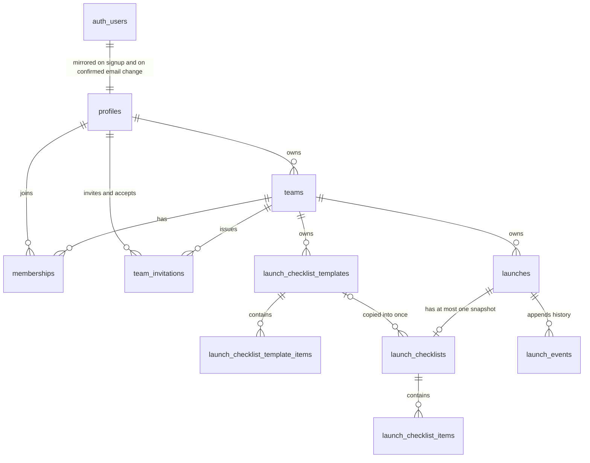

# Database Architecture

The database is defined only by `supabase/migrations/` and `supabase/config.toml`.
This document must be updated in the same pull request as any migration.

**Status**: identity and launch-workspace slices landed. Later slices extend the tables below.

## Quick path

Find the table in the ERD, confirm its tenant key and RLS policy below, then
change it through a new forward migration and update this file.

## Entity relationship diagram

## Ownership and tenant keys

| Scope | Rule |
|---|---|
| Global tables | Not team-owned; access is restricted per table. |
| Team-owned tables | Carry `NOT NULL team_id` and a composite foreign key. |
| Parent tables | Expose `UNIQUE (team_id, id)` so children cannot cross tenants. |

## Tables

| Table | Scope | Purpose | Introduced in |
|---|---|---|---|
| `profiles` | Global | Mirrors `auth.users`; the stable identity row tenant tables reference. | `20260828170000_identity` |
| `teams` | Global | Tenant root. `owner_user_id` is the sole governor. | `20260828170000_identity` |
| `memberships` | Team-owned | Grants a profile access to a team; exposes `(team_id, id)`. | `20260828170000_identity` |
| `team_invitations` | Team-owned | One hashed, expiring, single-use invitation addressed to one recipient. | `20260828210000_team_invitations` |
| `launches` | Team-owned | A launch and its lifecycle status; exposes `(team_id, id)`. | `20260829170000_launch_workspace_core` |
| `launch_checklist_templates` | Team-owned | Private reusable checklist; at most one team default. Exposes `(team_id, id)`. | `20260829170000_launch_workspace_core` |
| `launch_checklist_template_items` | Team-owned | Items belonging to one template. | `20260829170000_launch_workspace_core` |
| `launch_checklists` | Team-owned | The one editable snapshot copied into a launch. Exposes `(team_id, id)`. | `20260829170000_launch_workspace_core` |
| `launch_checklist_items` | Team-owned | Independently editable snapshot items. | `20260829170000_launch_workspace_core` |
| `launch_events` | Team-owned | Append-only launch history keyed by a monotonic `seq`. | `20260829170000_launch_workspace_core` |

### Launch statuses

`launch_status` is `preparing`, `active`, `archived`, `discarded` or `trash`.
Only these moves succeed, and every other pair is rejected without touching
state or history:

| From | To |
|---|---|
| `preparing` | `active` (needs a snapshot with every required item complete), `discarded` |
| `active` | `archived`, `discarded` |
| `discarded` | `preparing` — the only reopen |
| any non-`trash` | `trash`, which stores the exact prior state in `prior_status` |
| `trash` | its exact prior state, through `restore_launch` only |

`archived` never reopens. `trash` is a status, not a deletion: no individual
purge path exists anywhere in this schema.

## Migration ledger

Applied migrations are immutable. Corrections ship as new forward migrations.

| Migration | Adds | Rollback note |
|---|---|---|
| `20260828170000_identity` | Identity tables, forced RLS, policies, least-privilege grants, helper and trigger functions | Drop the three tables, four functions and two triggers; nothing else depends on them yet. |
| `20260828210000_team_invitations` | `team_invitations`, forced RLS, owner-only read/delete policies, and the hash, issue and accept functions | Drop the table and its three functions; memberships already granted stay valid. |
| `20260829120000_profile_email_sync` | `handle_user_email_change()` and the `auth.users` email trigger that mirrors a confirmed address into `profiles.email` | Ship a forward migration dropping **only** the trigger and the function. No table, column, policy, grant or profile value changes, and there is no session state to unwind. |
| `20260829170000_launch_workspace_core` | Two enums, six team-owned launch tables, forced RLS with member policies, column grants, and the five launch RPCs | Ship a forward migration that **revokes** the six table grants and the five `execute` privileges, closing the surface while retaining every row. Never edit the applied file and never drop the tables: launches, snapshots and history are user data, and `trash` already covers recoverable removal. |

## RLS and grant matrix

Every exposed team-owned table enables row level security before any grant.

| Table | RLS | Policy predicate | Grants to `authenticated` |
|---|---|---|---|
| `profiles` | enabled + forced | `user_id = auth.uid()` | `select`, `update (display_name)` |
| `teams` | enabled + forced | read: member or owner; write: `is_team_owner(id)` | `select`, `delete`, `insert (name)`, `update (name)` |
| `memberships` | enabled + forced | read: `is_team_member(team_id)`; write: `is_team_owner(team_id)` | `select`, `delete`, `insert (team_id, user_id)` |
| `team_invitations` | enabled + forced | read and delete: `is_team_owner(team_id)`; no insert or update policy exists, so the table is closed to direct writes | `select`, `delete` |
| `launches` | enabled + forced | read and update: `is_team_member(team_id)`; no insert policy — creation is RPC-only | `select`, `update (name, url, notes)` |
| `launch_checklist_templates` | enabled + forced | read, insert and update: `is_team_member(team_id)` | `select`, `insert (team_id, name)`, `update (name)` |
| `launch_checklist_template_items` | enabled + forced | read, insert and update: `is_team_member(team_id)` | `select`, `insert (team_id, template_id, label, is_required, position)`, `update (label, is_required, position)` |
| `launch_checklists` | enabled + forced | read: `is_team_member(team_id)`; no insert or update policy — snapshots are RPC-only | `select` |
| `launch_checklist_items` | enabled + forced | read and update: `is_team_member(team_id)`; no insert policy — items arrive by copy | `select`, `update (label, is_required, position, is_complete)` |
| `launch_events` | enabled + forced | read: `is_team_member(team_id)`; no insert or update policy — history is append-only via RPC | `select` |

No launch table grants `delete` to anyone, so there is no individual purge path.
`launches.status`, `launches.prior_status` and
`launch_checklist_templates.is_default` are never granted: a forged lifecycle or
default write fails at the privilege layer before RLS is consulted.

`anon` and `PUBLIC` hold no privilege on any table. The migration revokes
Supabase's default blanket grant before issuing the explicit grants above.

## Functions and triggers

| Object | Type | `search_path` | Execute granted to |
|---|---|---|---|
| `is_team_member(uuid)` | `security definer` helper | `''` | `authenticated` |
| `is_team_owner(uuid)` | `security definer` helper | `''` | `authenticated` |
| `handle_new_user()` | `security definer` trigger on `auth.users` | `''` | nobody — trigger only |
| `handle_user_email_change()` | `security definer` trigger on `auth.users` | `''` | nobody — trigger only |
| `ensure_owner_membership()` | `security definer` trigger on `public.teams` | `''` | nobody — trigger only |
| `hash_invitation_token(text)` | `security invoker`, `immutable` | `''` | nobody — internal only |
| `create_invitation(uuid, text)` | `security definer` RPC, owner-only | `''` | `authenticated` |
| `accept_invitation(text)` | `security definer` RPC, atomic claim | `''` | `authenticated` |
| `create_launch(uuid, uuid, text)` | `security definer` RPC, idempotent on the caller's launch id | `''` | `authenticated` |
| `transition_launch(uuid, launch_status)` | `security definer` RPC | `''` | `authenticated` |
| `restore_launch(uuid)` | `security definer` RPC | `''` | `authenticated` |
| `apply_checklist_template(uuid, uuid)` | `security definer` RPC | `''` | `authenticated` |
| `set_default_checklist_template(uuid, uuid)` | `security definer` RPC | `''` | `authenticated` |

The helpers are `security definer` on purpose: the `memberships` read policy calls
`is_team_member`, which reads `memberships`. Definer rights break that recursion.

`handle_user_email_change()` fires `after update of email on auth.users`, so it mirrors a
**confirmed** address only: Supabase Auth parks a requested address in `auth.users.email_change`
and promotes it to `auth.users.email` only after verification. Its `update ... where user_id =
new.id` is account-local, cannot create a profile, and no-ops when none exists. Both `auth.users`
triggers are `security definer` for the same reason: they run as `supabase_auth_admin`, which holds
no privilege on `public.profiles` and cannot pass its forced RLS.

`create_invitation` returns the plaintext token once and stores only its SHA-256 hash.
`accept_invitation` consumes an invitation with a single conditional `update` — unaccepted,
unexpired, and addressed to the caller's verified email — then inserts one membership, so
concurrent callers cannot both win and a replayed token changes nothing.

### Launch write paths

Lifecycle status, history, snapshots and the team default are never written
directly by a client. Each RPC checks `is_team_member(team_id)` first, then
commits its state change and its event together, so history can never disagree
with state: any raise writes nothing at all.

| RPC | Effect | Event appended |
|---|---|---|
| `create_launch` | Inserts a `preparing` launch under the caller's id; a retry of that id returns it unchanged | `created`, once per launch |
| `transition_launch` | Applies one accepted move, storing `prior_status` only for `trash` | `transitioned` |
| `restore_launch` | Returns a trashed launch to its exact prior state | `transitioned` |
| `apply_checklist_template` | Copies a same-team template into one snapshot | `checklist_applied` |
| `set_default_checklist_template` | Demotes peers and promotes one, or clears with `null` | none |

Locks are always taken in the order `teams → launches → launch_checklist_templates`,
each function taking a prefix of it, so concurrent callers cannot deadlock.

| SQLSTATE | Meaning |
|---|---|
| `42501` | Absent row **or** non-member, with identical message text |
| `22023` | Invalid input, unlisted transition, or a cross-team template |
| `23514` | Activation without a snapshot or with an incomplete required item |
| `23505` | Second snapshot, or a lost concurrent default race |

`42501` is deliberately opaque. An absent id and another tenant's id answer
identically, so no RPC can be used as an existence oracle for another team.
