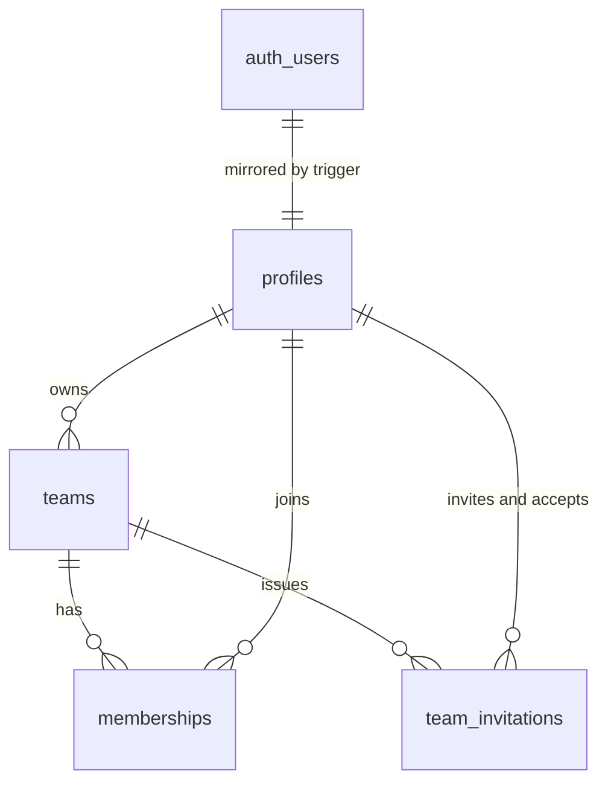

# Database Architecture

The database is defined only by `supabase/migrations/` and `supabase/config.toml`.
This document must be updated in the same pull request as any migration.

**Status**: identity slice landed. Later slices extend the tables below.

## Quick path

Find the table in the ERD, confirm its tenant key and RLS policy below, then
change it through a new forward migration and update this file.

## Entity relationship diagram

## Ownership and tenant keys

| Scope | Rule |
|---|---|
| Global tables | Not team-owned; access is restricted per table. |
| Team-owned tables | Carry `NOT NULL team_id` and a composite foreign key. |
| Parent tables | Expose `UNIQUE (team_id, id)` so children cannot cross tenants. |

## Tables

| Table | Scope | Purpose | Introduced in |
|---|---|---|---|
| `profiles` | Global | Mirrors `auth.users`; the stable identity row tenant tables reference. | `20260828170000_identity` |
| `teams` | Global | Tenant root. `owner_user_id` is the sole governor. | `20260828170000_identity` |
| `memberships` | Team-owned | Grants a profile access to a team; exposes `(team_id, id)`. | `20260828170000_identity` |
| `team_invitations` | Team-owned | One hashed, expiring, single-use invitation addressed to one recipient. | `20260828210000_team_invitations` |

## Migration ledger

Applied migrations are immutable. Corrections ship as new forward migrations.

| Migration | Adds | Rollback note |
|---|---|---|
| `20260828170000_identity` | Identity tables, forced RLS, policies, least-privilege grants, helper and trigger functions | Drop the three tables, four functions and two triggers; nothing else depends on them yet. |
| `20260828210000_team_invitations` | `team_invitations`, forced RLS, owner-only read/delete policies, and the hash, issue and accept functions | Drop the table and its three functions; memberships already granted stay valid. |

## RLS and grant matrix

Every exposed team-owned table enables row level security before any grant.

| Table | RLS | Policy predicate | Grants to `authenticated` |
|---|---|---|---|
| `profiles` | enabled + forced | `user_id = auth.uid()` | `select`, `update (display_name)` |
| `teams` | enabled + forced | read: member or owner; write: `is_team_owner(id)` | `select`, `delete`, `insert (name)`, `update (name)` |
| `memberships` | enabled + forced | read: `is_team_member(team_id)`; write: `is_team_owner(team_id)` | `select`, `delete`, `insert (team_id, user_id)` |
| `team_invitations` | enabled + forced | read and delete: `is_team_owner(team_id)`; no insert or update policy exists, so the table is closed to direct writes | `select`, `delete` |

`anon` and `PUBLIC` hold no privilege on any table. The migration revokes
Supabase's default blanket grant before issuing the explicit grants above.

## Functions and triggers

| Object | Type | `search_path` | Execute granted to |
|---|---|---|---|
| `is_team_member(uuid)` | `security definer` helper | `''` | `authenticated` |
| `is_team_owner(uuid)` | `security definer` helper | `''` | `authenticated` |
| `handle_new_user()` | `security definer` trigger on `auth.users` | `''` | nobody — trigger only |
| `ensure_owner_membership()` | `security definer` trigger on `public.teams` | `''` | nobody — trigger only |
| `hash_invitation_token(text)` | `security invoker`, `immutable` | `''` | nobody — internal only |
| `create_invitation(uuid, text)` | `security definer` RPC, owner-only | `''` | `authenticated` |
| `accept_invitation(text)` | `security definer` RPC, atomic claim | `''` | `authenticated` |

The helpers are `security definer` on purpose: the `memberships` read policy calls
`is_team_member`, which reads `memberships`. Definer rights break that recursion.

`create_invitation` returns the plaintext token once and stores only its SHA-256 hash.
`accept_invitation` consumes an invitation with a single conditional `update` — unaccepted,
unexpired, and addressed to the caller's verified email — then inserts one membership, so
concurrent callers cannot both win and a replayed token changes nothing.
