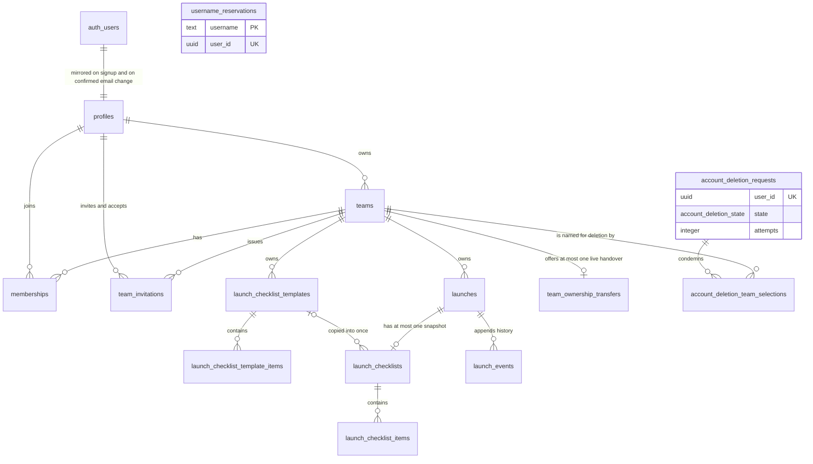

# Database Architecture

The database is defined only by `supabase/migrations/` and `supabase/config.toml`.
This document must be updated in the same pull request as any migration.

**Status**: identity, launch-workspace, username-reservation and account-deletion
slices landed. Later slices extend the tables below.

## Quick path

Find the table in the ERD, confirm its tenant key and RLS policy below, then
change it through a new forward migration and update this file.

## Entity relationship diagram

`username_reservations` and `account_deletion_requests` are drawn unconnected on
purpose: neither carries a foreign key, so they are the two tables that outlive the
account they describe. For the receipt that is the whole point — any referential
action would destroy the record of a deletion at the moment it succeeded.

## Ownership and tenant keys

| Scope | Rule |
|---|---|
| Global tables | Not team-owned; access is restricted per table. |
| Team-owned tables | Carry `NOT NULL team_id` and a composite foreign key. |
| Parent tables | Expose `UNIQUE (team_id, id)` so children cannot cross tenants. |

## Tables

| Table | Scope | Purpose | Introduced in |
|---|---|---|---|
| `profiles` | Global | Mirrors `auth.users`; the stable identity row tenant tables reference. | `20260828170000_identity` |
| `teams` | Global | Tenant root. `owner_user_id` is the sole governor. | `20260828170000_identity` |
| `memberships` | Team-owned | Grants a profile access to a team; exposes `(team_id, id)`. | `20260828170000_identity` |
| `team_invitations` | Team-owned | One hashed, expiring, single-use invitation addressed to one recipient. | `20260828210000_team_invitations` |
| `launches` | Team-owned | A launch and its lifecycle status; exposes `(team_id, id)`. | `20260829170000_launch_workspace_core` |
| `launch_checklist_templates` | Team-owned | Private reusable checklist; at most one team default. Exposes `(team_id, id)`. | `20260829170000_launch_workspace_core` |
| `launch_checklist_template_items` | Team-owned | Items belonging to one template. | `20260829170000_launch_workspace_core` |
| `launch_checklists` | Team-owned | The one editable snapshot copied into a launch. Exposes `(team_id, id)`. | `20260829170000_launch_workspace_core` |
| `launch_checklist_items` | Team-owned | Independently editable snapshot items. | `20260829170000_launch_workspace_core` |
| `launch_events` | Team-owned | Append-only launch history keyed by a monotonic `seq`. | `20260829170000_launch_workspace_core` |
| `username_reservations` | Global | One permanent, globally unique username per account. Carries **no** foreign key, so it survives account deletion. | `20260901120000_username_reservation` |
| `team_ownership_transfers` | Global | One live owner-to-member handover offer per team, expiring after seven days. | `20260902110000_account_deletion_transfers` |
| `account_deletion_requests` | Global | Non-PII deletion receipt: subject, `state`, `attempts`. Carries **no** foreign key, so it survives the account. | `20260902120000_account_deletion_requests` |
| `account_deletion_team_selections` | Global | The teams a request condemned, recorded at request time and cascading off both parents. | `20260902120000_account_deletion_requests` |

### Launch statuses

`launch_status` is `preparing`, `active`, `archived`, `discarded` or `trash`.
Only these moves succeed, and every other pair is rejected without touching
state or history:

| From | To |
|---|---|
| `preparing` | `active` (needs a snapshot with every required item complete), `discarded` |
| `active` | `archived`, `discarded` |
| `discarded` | `preparing` — the only reopen |
| any non-`trash` | `trash`, which stores the exact prior state in `prior_status` |
| `trash` | its exact prior state, through `restore_launch` only |

`archived` never reopens. `trash` is a status, not a deletion: no individual
purge path exists anywhere in this schema.

## Migration ledger

Applied migrations are immutable. Corrections ship as new forward migrations.

| Migration | Adds | Rollback note |
|---|---|---|
| `20260828170000_identity` | Identity tables, forced RLS, policies, least-privilege grants, helper and trigger functions | Drop the three tables, four functions and two triggers; nothing else depends on them yet. |
| `20260828210000_team_invitations` | `team_invitations`, forced RLS, owner-only read/delete policies, and the hash, issue and accept functions | Drop the table and its three functions; memberships already granted stay valid. |
| `20260829120000_profile_email_sync` | `handle_user_email_change()` and the `auth.users` email trigger that mirrors a confirmed address into `profiles.email` | Ship a forward migration dropping **only** the trigger and the function. No table, column, policy, grant or profile value changes, and there is no session state to unwind. |
| `20260829170000_launch_workspace_core` | Two enums, six team-owned launch tables, forced RLS with member policies, column grants, and the five launch RPCs | Ship a forward migration that **revokes** the six table grants and the five `execute` privileges, closing the surface while retaining every row. Never edit the applied file and never drop the tables: launches, snapshots and history are user data, and `trash` already covers recoverable removal. |
| `20260901120000_username_reservation` | `username_reservations` with forced RLS, no policy, no grant and no foreign key, plus the atomic `claim_username(text)` RPC | **Deliberately asymmetric.** Ship a forward migration that revokes `execute` on `claim_username(text)`; that closes the claim surface. Never drop the table — a reservation must outlive the account that made it, which is the entire point of a permanent name. |
| `20260901130000_username_gate` | `has_username()`, `enforce_username_claim()`, ten statement-level gate triggers, and the team-scoped `resolve_team_usernames(uuid)` RPC | **Fully symmetric.** Ship a forward migration that drops the ten triggers and revokes `execute` on `resolve_team_usernames(uuid)`; the schema is then exactly what it was before the gate. It must leave the registry from the previous migration standing. |
| `20260902100000_account_deletion_fk_relaxation` | Relaxes eight historical creator/actor foreign keys to `on delete set null` and drops their `not null`; re-guards `create_launch` for a null creator | **Not symmetric in practice.** Re-tightening a relaxed key fails once any historical actor is null, and the null is the retained fact. Withdraw the deletion surface instead, above. |
| `20260902110000_account_deletion_transfers` | `team_ownership_transfers`, its partial unique pending index, `request_team_ownership_transfer(uuid, uuid)`, `accept_team_ownership_transfer(uuid)`, and the eleventh gate trigger | Revoke `execute` on both RPCs; the table is then unreachable. Teams already handed over stay where they landed. |
| `20260902120000_account_deletion_requests` | `account_deletion_state`, `account_deletion_requests`, `account_deletion_team_selections`, `request_account_deletion(uuid[])`, and the twelfth gate trigger | Revoke `execute` on the RPC. **Never drop `account_deletion_requests`** — the receipt is the only record that a deletion happened. |
| `20260902130000_account_deletion_claim_ledger` | `account_deletion_requests.attempts`, `account_deletion_status(uuid)`, `claim_account_deletion(uuid)`, and the first two `service_role` grants in the schema | Revoke the two `execute` grants from `service_role`; nothing can then be admitted or read. The column stays: it is the retry ledger. |
| `20260902140000_account_deletion_finalization` | `finalize_account_deletion(uuid)` — the `22023` guard, idempotent `done`, condemned teams before the identity, the outcome write — and its `service_role` grant | Revoke `execute` from `service_role`, then drop the function. |
| `20260902145000_account_deletion_invitation_revocation` | `create or replace` of the finalizer adding both invitation revocation scopes before the identity step, plus the `if not step_failed` ordered halt | **Forward replace, never a drop.** A `drop` + `create` resets the function ACL to `DEFAULT`, reopening the privileged surface to every caller. Restore the previous body with `create or replace`. |
| `20260902150000_account_deletion_receipt_retention` | `sweep_expired_deletion_receipts()` and the `after update` trigger that purges terminal receipts past 30 days, 100 per firing, with `execute` revoked from every role | Drop the trigger, then the function. Never drop the receipt table. |

## RLS and grant matrix

Every exposed team-owned table enables row level security before any grant.

| Table | RLS | Policy predicate | Grants to `authenticated` |
|---|---|---|---|
| `profiles` | enabled + forced | `user_id = auth.uid()` | `select`, `update (display_name)` |
| `teams` | enabled + forced | read: member or owner; write: `is_team_owner(id)` | `select`, `delete`, `insert (name)`, `update (name)` |
| `memberships` | enabled + forced | read: `is_team_member(team_id)`; write: `is_team_owner(team_id)` | `select`, `delete`, `insert (team_id, user_id)` |
| `team_invitations` | enabled + forced | read and delete: `is_team_owner(team_id)`; no insert or update policy exists, so the table is closed to direct writes | `select`, `delete` |
| `launches` | enabled + forced | read and update: `is_team_member(team_id)`; no insert policy — creation is RPC-only | `select`, `update (name, url, notes)` |
| `launch_checklist_templates` | enabled + forced | read, insert and update: `is_team_member(team_id)` | `select`, `insert (team_id, name)`, `update (name)` |
| `launch_checklist_template_items` | enabled + forced | read, insert and update: `is_team_member(team_id)` | `select`, `insert (team_id, template_id, label, is_required, position)`, `update (label, is_required, position)` |
| `launch_checklists` | enabled + forced | read: `is_team_member(team_id)`; no insert or update policy — snapshots are RPC-only | `select` |
| `launch_checklist_items` | enabled + forced | read and update: `is_team_member(team_id)`; no insert policy — items arrive by copy | `select`, `update (label, is_required, position, is_complete)` |
| `launch_events` | enabled + forced | read: `is_team_member(team_id)`; no insert or update policy — history is append-only via RPC | `select` |
| `username_reservations` | enabled + forced | none — no policy of any kind exists, so every direct read, write and enumeration is denied by default | none — `claim_username` is the only door |
| `team_ownership_transfers` | enabled + forced | none — the two transfer RPCs are the only door | none |
| `account_deletion_requests` | enabled + forced | none — the request RPC writes it and only `service_role` RPCs read it | none |
| `account_deletion_team_selections` | enabled + forced | none — written only inside the request RPC's own transaction | none |

No launch table grants `delete` to anyone, so there is no individual purge path.
`launches.status`, `launches.prior_status` and
`launch_checklist_templates.is_default` are never granted: a forged lifecycle or
default write fails at the privilege layer before RLS is consulted.

`anon` and `PUBLIC` hold no privilege on any table. The migration revokes
Supabase's default blanket grant before issuing the explicit grants above.

## Functions and triggers

| Object | Type | `search_path` | Execute granted to |
|---|---|---|---|
| `is_team_member(uuid)` | `security definer` helper | `''` | `authenticated` |
| `is_team_owner(uuid)` | `security definer` helper | `''` | `authenticated` |
| `handle_new_user()` | `security definer` trigger on `auth.users` | `''` | nobody — trigger only |
| `handle_user_email_change()` | `security definer` trigger on `auth.users` | `''` | nobody — trigger only |
| `ensure_owner_membership()` | `security definer` trigger on `public.teams` | `''` | nobody — trigger only |
| `hash_invitation_token(text)` | `security invoker`, `immutable` | `''` | nobody — internal only |
| `create_invitation(uuid, text)` | `security definer` RPC, owner-only | `''` | `authenticated` |
| `accept_invitation(text)` | `security definer` RPC, atomic claim | `''` | `authenticated` |
| `create_launch(uuid, uuid, text)` | `security definer` RPC, idempotent on the caller's launch id | `''` | `authenticated` |
| `transition_launch(uuid, launch_status)` | `security definer` RPC | `''` | `authenticated` |
| `restore_launch(uuid)` | `security definer` RPC | `''` | `authenticated` |
| `apply_checklist_template(uuid, uuid)` | `security definer` RPC | `''` | `authenticated` |
| `set_default_checklist_template(uuid, uuid)` | `security definer` RPC | `''` | `authenticated` |
| `claim_username(text)` | `security definer` RPC, atomic one-time claim | `''` | `authenticated` |
| `has_username()` | `security definer` predicate | `''` | nobody — the gate's own question |
| `enforce_username_claim()` | `security definer` statement trigger on ten tables | `''` | nobody — trigger only |
| `resolve_team_usernames(uuid)` | `security definer` RPC, team-scoped | `''` | `authenticated` |
| `request_team_ownership_transfer(uuid, uuid)` | `security definer` RPC, owner-only, supersedes the standing offer | `''` | `authenticated` |
| `accept_team_ownership_transfer(uuid)` | `security definer` RPC, recipient-bound, re-checks membership | `''` | `authenticated` |
| `request_account_deletion(uuid[])` | `security definer` RPC, self-only, records intent | `''` | `authenticated` |
| `account_deletion_status(uuid)` | `security definer` RPC, reads one receipt's state | `''` | **`service_role` only** |
| `claim_account_deletion(uuid)` | `security definer` RPC, the admission point and retry bound | `''` | **`service_role` only** |
| `finalize_account_deletion(uuid)` | `security definer` RPC, the ordered deletion itself | `''` | **`service_role` only** |
| `sweep_expired_deletion_receipts()` | `security definer` trigger on `public.account_deletion_requests` | `''` | nobody — revoked from `service_role` too |

The helpers are `security definer` on purpose: the `memberships` read policy calls
`is_team_member`, which reads `memberships`. Definer rights break that recursion.

`handle_user_email_change()` fires `after update of email on auth.users`, so it mirrors a
**confirmed** address only: Supabase Auth parks a requested address in `auth.users.email_change`
and promotes it to `auth.users.email` only after verification. Its `update ... where user_id =
new.id` is account-local, cannot create a profile, and no-ops when none exists. Both `auth.users`
triggers are `security definer` for the same reason: they run as `supabase_auth_admin`, which holds
no privilege on `public.profiles` and cannot pass its forced RLS.

`create_invitation` returns the plaintext token once and stores only its SHA-256 hash.
`accept_invitation` consumes an invitation with a single conditional `update` — unaccepted,
unexpired, and addressed to the caller's verified email — then inserts one membership, so
concurrent callers cannot both win and a replayed token changes nothing.

### Launch write paths

Lifecycle status, history, snapshots and the team default are never written
directly by a client. Each RPC checks `is_team_member(team_id)` first, then
commits its state change and its event together, so history can never disagree
with state: any raise writes nothing at all.

| RPC | Effect | Event appended |
|---|---|---|
| `create_launch` | Inserts a `preparing` launch under the caller's id; a retry of that id returns it unchanged | `created`, once per launch |
| `transition_launch` | Applies one accepted move, storing `prior_status` only for `trash` | `transitioned` |
| `restore_launch` | Returns a trashed launch to its exact prior state | `transitioned` |
| `apply_checklist_template` | Copies a same-team template into one snapshot | `checklist_applied` |
| `set_default_checklist_template` | Demotes peers and promotes one, or clears with `null` | none |

Locks are always taken in the order `teams → launches → launch_checklist_templates`,
each function taking a prefix of it, so concurrent callers cannot deadlock.

| SQLSTATE | Meaning |
|---|---|
| `42501` | Absent row **or** non-member, with identical message text |
| `22023` | Invalid input, unlisted transition, or a cross-team template |
| `23514` | Activation without a snapshot or with an incomplete required item |
| `23505` | Second snapshot, or a lost concurrent default race |

`42501` is deliberately opaque. An absent id and another tenant's id answer
identically, so no RPC can be used as an existence oracle for another team.

## Username reservation and the onboarding gate

Two migrations, deliberately split: `20260901120000_username_reservation` is the
registry and the claim, and `20260901130000_username_gate` is the rule that gives
them force. Nothing in the first depends on the second.

A username is `[a-z0-9_]{3,30}`, lowercased and trimmed by the database, claimed
exactly once per account, and permanent. `claim_username` is a single
`insert ... on conflict do nothing`, so one unique constraint covers "the name is
taken" and the other covers "you already hold one" — two concurrent claimants
cannot both win, and no branch can observe which case it hit.

### Why triggers carry the gate

Every protected write already travels through a `SECURITY DEFINER` RPC owned by
`postgres`, and `postgres` holds `BYPASSRLS`, so a **policy would never run** on
those paths. Rewriting the RPC bodies would reach them but leaks a bypass every
time an RPC is added; widening `is_team_member` would break reads and resolution.
A `BEFORE ... FOR EACH STATEMENT` trigger sits below all of it.

Statement level, not row level: the gate asks one question about the *caller*,
never about a row. Per-row evaluation would only multiply the cost, and a
statement matching nothing must still be refused — that is what "denied without
side effects" has to mean.

The gate no-ops when `auth.uid()` is null. `postgres` and `service_role` bypass
RLS anyway, `anon` holds no privilege on these tables, and an unconditional raise
would break `handle_new_user`, which mirrors a new account before any claim could
exist. `profiles` is gated on `update of display_name` only, so the confirmed-email
mirror keeps working untouched.

`teams` insert and delete are gated twice over, because `ensure_owner_membership`
and the delete cascade each perform a gated `memberships` write. That redundancy
is kept as the cheapest available depth.

### Resolution

`resolve_team_usernames(team_id)` joins `memberships` to the registry and checks
`is_team_member(p_team_id)` **inside** the query. A caller outside the team gets
an empty set — identical to a team holding no claims and to a team that does not
exist. No refusal, no error, no difference, so it cannot be worked into an
existence oracle. It reports claims, not the roster.

| SQLSTATE | Meaning |
|---|---|
| `22023` | Invalid format (the one distinguishable rejection, since a caller can compute it), or a refused claim — name taken and already-claimed read identically |
| `42501` | The gate: a confirmed account without a claim attempted any other protected write |

### Typed access

`src/modules/identity/{types,repository,service}.ts` wraps the five RPCs the
database grants `authenticated`: `claimUsername`, `resolveTeamUsernames`,
`offerTeam`, `acceptTeam` and `requestAccountDeletion`. `repository.ts` is the only
file that reaches the database; `service.ts` never calls `.from(` or `.rpc(` itself.
Domain types are projected from `Database["public"]["Functions"]`, so each wrapper's
answer follows the schema rather than restating it.
`tests/database/identity-module.test.ts` pins all of it, including the absence of
any privileged entry point in `src/modules/`.

## Account deletion lifecycle

Deletion is a database contract, not a service. `postgres` holds `BYPASSRLS` on
`auth.users`, so a definer function deletes the identity in SQL — no Admin API and
no scheduler. There is no grace period, cancellation, recovery or restoration.

### Quick path

1. Resolve every owned team: hand it over, or name it in the request.
2. `request_account_deletion(uuid[])` records a `pending` receipt.
3. A privileged operator calls `claim_account_deletion`, then
   `finalize_account_deletion`. Retry is that same pair again.

### States and entry points

`account_deletion_state` is `pending`, `in_progress`, `done` or `failed`.

| Entry point | Granted to | Effect |
|---|---|---|
| `request_account_deletion` | `authenticated` | Writes the caller's own `pending` receipt and its team selections; a second call returns the standing state unchanged |
| `claim_account_deletion` | `service_role` | The single admission point: moves `pending`/`failed` to `in_progress` and spends one of three executions |
| `finalize_account_deletion` | `service_role` | Runs the ordered deletion; refuses anything but `in_progress` with `22023`, except a `done` receipt, which it answers idempotently |
| `account_deletion_status` | `service_role` | Reads one receipt's state, or `null` for an account that never asked |

The bound lives on `account_deletion_requests.attempts`, and only the claim
increments it. Three executions are admitted — one plus two retries — and the
fourth claim returns the frozen `failed`. Because the claim is the only admission
point, two callers racing the same receipt cannot both spend an execution.

### Ordered finalization

Each step runs in its own `begin/exception` block, and `if not step_failed` stops
every later step, so steps `1..k-1` stand and a retry continues from there:

1. Delete the condemned teams. Selections cascade off `teams`, so a retry is a no-op.
2. Revoke unaccepted invitations issued by the subject **or** addressed to its
   profile email. This must precede the profile delete, which takes the address away.
3. Delete the `auth.users` identity, and with it the profile, email and `display_name`.

A live owned team refuses the identity step with `23503`, which is what orders the
whole procedure: a `done` account that owned a condemned team is itself the proof
the team went first.

What survives is the username reservation — permanently unavailable, holding no
email or profile data — and the non-PII receipt. A same-email signup afterwards is
an unrelated UUID with no restored teams, history or configuration. Historical
`created_by` and `actor_user_id` references become null while every other fact and
the append order stay tenant-queryable.

### Retention

`sweep_expired_deletion_receipts()` fires `after update ... when (new.state in
('done','failed'))` and deletes terminal receipts older than 30 days, at most 100
per firing. Its delete sits in a block whose handler discards everything, so a
failed purge leaves the receipt and can never abort the finalizer — purging is the
only MAY in this lifecycle, and it must not regress a MUST. Nothing schedules it:
no `pg_cron`, no `pg_net`, no extension. A table nobody finalizes against is never
swept, which is the spec's position rather than an oversight.

| SQLSTATE | Meaning |
|---|---|
| `42501` | Not the owner, teams unresolved, an unowned or absent team, or the username gate |
| `22023` | Not the intended recipient, an expired or spent offer, or a receipt that is not `in_progress` |
| `23503` | A live owned team refusing the identity delete |
